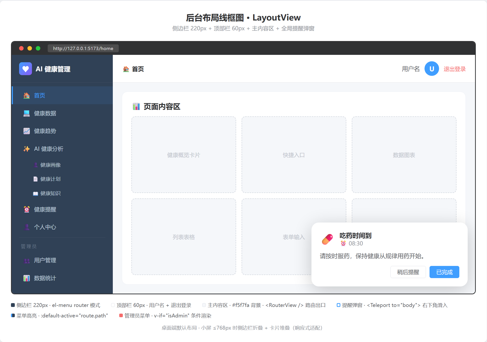

# 前端界面设计

> AI 个性化私人健康管理系统 · 界面设计文档
版本 1.0

---

## 1. 设计概述

### 1.1 UI 框架

系统使用 **Element Plus 2.14** 作为 UI 组件库，在此基础上进行定制化样式开发。全局采用中文语言包。

### 1.2 设计原则

|原则|说明|
|-|-|
|一致性|所有页面统一使用 Element Plus 组件风格，自定义样式遵循其设计变量|
|响应式|支持桌面端（≥768px）和小屏适配，使用 CSS Grid + Flexbox|
|反馈清晰|加载有 Loading 动画，空数据有空状态占位，错误有 Toast 提示|
|色彩语义|成功=绿色、警告=橙色、危险=红色、信息=蓝色，与 Element Plus 保持一致|
|AI 差异化|AI 相关页面使用渐变色、加载动画，突出智能化体验|

---

## 2. 整体布局

### 2.1 两种布局模式

```Mermaid
graph TB
    subgraph "独立页布局（登录/注册）"
        INDEP[全屏居中卡片<br/>无侧边栏/顶栏<br/>渐变背景]
    end

    subgraph "后台布局（业务页面）"
        SHELL[LayoutView]
        SHELL --> SIDEBAR[左侧边栏 220px<br/>深色背景 #304156]
        SHELL --> RIGHT[右侧区域]
        RIGHT --> HEADER[顶部导航栏 60px<br/>白色背景 + 底部边框]
        RIGHT --> MAIN[主内容区<br/>浅灰背景 #f5f7fa<br/>padding: 20px]
    end
```

### 2.2 后台布局线框图



---

## 3. 色彩体系（Warm Clinic）

### 3.1 主色调

| 用途 | 色值 | 使用场景 |
|------|------|----------|
| 主题深青 | `#0D7377` | 按钮、链接、选中态、侧边栏激活态 |
| 主题浅底 | `#E8F4F5` | hover 背景、选中态浅底 |
| 珊瑚红 | `#E85D4A` | 危险操作、血压收缩压曲线、重点标记 |
| 琥珀 | `#D4913E` | 警告状态、中级警示 |
| 侧边栏背景 | `#1A2C2B` | 深青黑 + SVG 噪点纹理 |
| 侧边栏文字 | `#8CA5A3` | 菜单未选中态 |
| 内容区背景 | `#FAF8F5` | 暖纸白，替代冷灰 |
| 卡片 | `#FFFFFF` | 纯白卡片 + 微阴影 |

### 3.2 功能色

| 用途 | 色值 | 使用场景 |
|------|------|----------|
| 成功/达标 | `#0D7377` | 达标标签、环形图达标段 |
| 警告 | `#D4913E` | 中等风险 |
| 危险/未达标 | `#E85D4A` | 高风险、删除操作 |
| 睡眠色 | `#6366F1` | 睡眠数据、环形图睡眠段 |
| 运动色 | `#0D7377` | 运动数据、环形图运动段 |

### 3.3 圆角与阴影

| 层级 | 值 |
|------|-----|
| 小圆角 | `6px` |
| 中圆角 | `10px` |
| 大圆角 | `16px` |
| 超大圆角 | `24px` |
| 卡片投影 | `0 2px 8px rgba(26,44,43,0.05)` |
| 浮起投影 | `0 8px 28px rgba(26,44,43,0.1)` |
| 弹窗投影 | `0 16px 56px rgba(26,44,43,0.15)` |

---

## 4. 页面设计

### 4.1 登录页


**设计要点：**

- 紫色渐变全屏背景，营造科技感

- 白色居中卡片，圆角 + 阴影

- 表单左对齐，标签宽度 80px

- 登录按钮 full-width，高度 40px

### 4.2 注册页

- 与登录页布局一致，背景改为浅灰 `#f5f7fa`

- 额外增加"用户名"和"确认密码"字段

- 底部链接改为"已有账号？立即登录"

### 4.3 首页（HomeView）


**设计要点：**

- 欢迎横幅：蓝紫渐变背景，白色文字，圆角 16px

- 快捷入口：3×2 Grid，每张卡片左侧彩色竖条 + hover 上浮效果

- 底部两栏并排（1:1），响应式小屏时堆叠

- 所有卡片圆角 12px

### 4.4 健康数据管理页


### 4.5 健康趋势页


### 4.6 AI 健康画像页


### 4.7 AI 健康计划页


### 4.8 健康提醒页


### 4.9 管理员数据统计页


---

## 5. 通用组件设计

### 5.1 LoadingSpinner

```Plain Text
┌────────────────────┐
│       ⟳ (旋转)      │
│  AI 正在分析您的    │
│  健康数据...        │
└────────────────────┘
```

- 使用 Element Plus `Loading` 图标，CSS `@keyframes spin` 旋转动画

- 可配置图标大小（默认 32px）和文字

- 垂直居中排列，文字灰色

### 5.2 EmptyState

```Plain Text
┌────────────────────┐
│       📄 (图标)      │
│   暂无健康数据      │
└────────────────────┘
```

- 48px 灰色图标 + 描述文字

- 文字通过 prop 传入，默认"暂无数据"

- 在健康数据列表、趋势图、AI 画像等多个场景复用

### 5.3 卡片组件

所有内容卡片遵循统一规范：

- `el-card` + `shadow="never"`（列表卡片）/ `shadow="hover"`（交互卡片）

- 圆角 12px

- 内边距由 el-card 默认提供（20px）

- 卡片间距 20px（`margin-bottom: 20px`）

### 5.4 表单布局

- 筛选项使用 `el-form :inline="true"` 水平排列

- 表单项使用 `flex-wrap: wrap` 适应窄屏

- 标签宽度统一 80px（登录/注册页）或不设宽度（筛选栏）

---

## 6. 响应式设计

### 6.1 断点

|断点|布局变化|
|-|-|
|≥769px|默认桌面布局|
|≤768px|侧边栏折叠、Grid 单列、卡片堆叠|

### 6.2 响应式适配（以首页为例）

```CSS
@media (max-width: 768px) {
  .welcome-banner { flex-direction: column; }
  .quick-grid { grid-template-columns: 1fr; }
  .bottom-section { grid-template-columns: 1fr; }
}
```

---

## 7. 交互规范

### 7.1 加载状态

|场景|处理方式|
|-|-|
|数据列表加载|`v-loading` 指令 + 表格骨架|
|AI 生成中|`LoadingSpinner` 组件 + 文字提示|
|表单提交中|按钮 `:loading` 属性 + 禁用|

### 7.2 空状态

所有列表/图表在无数据时显示 `EmptyState` 组件，而非空白区域。

### 7.3 错误提示

- 表单验证错误 → Element Plus 表单校验提示（红色文字）

- 业务错误 → `ElMessage.error()` 顶部浮动提示

- AI 服务异常 → 特殊处理，精简提示文案

- 401 → 自动跳转登录，不显示 toast

### 7.4 成功提示

- 操作成功 → `ElMessage.success()` 绿色提示

- 3 秒自动消失

### 7.5 确认操作

- 删除操作 → `el-popconfirm` 气泡确认框

- 管理员启用/禁用用户 → `ElMessageBox.confirm` 模态确认框

---

## 8. 动画与过渡

|元素|动画|说明|
|-|-|-|
|快捷卡片 hover|`translateY(-3px)` + `box-shadow`|0.25s ease|
|侧边栏菜单 hover|Element Plus 内置过渡|—|
|提醒弹窗出现|`slideUp` 0.35s（translateY + opacity）|右下角滑入|
|提醒弹窗消失|`fade` 0.3s（opacity）|淡出|
|Loading 图标|`spin` 1s linear infinite|持续旋转|
|风险指示器定位|`left` 0.6s ease|平滑移动到目标位置|

