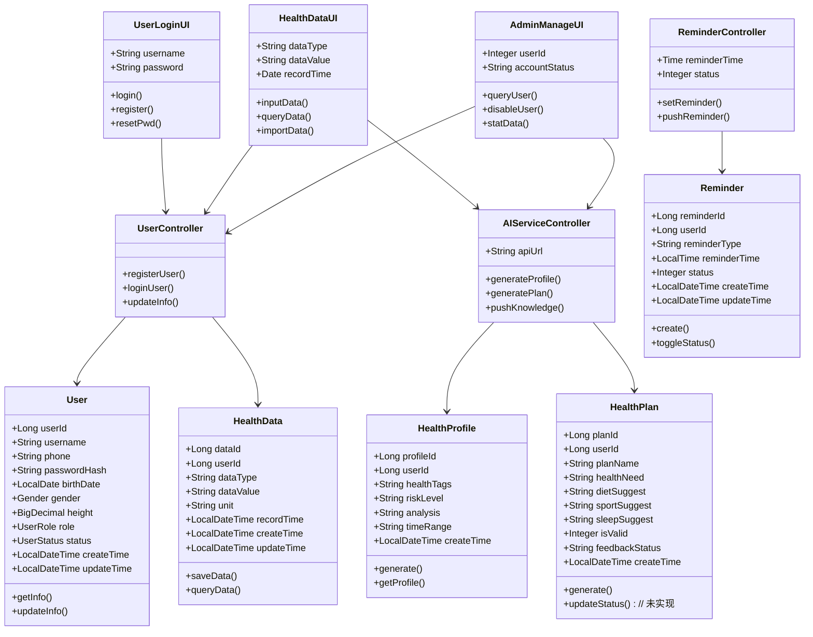
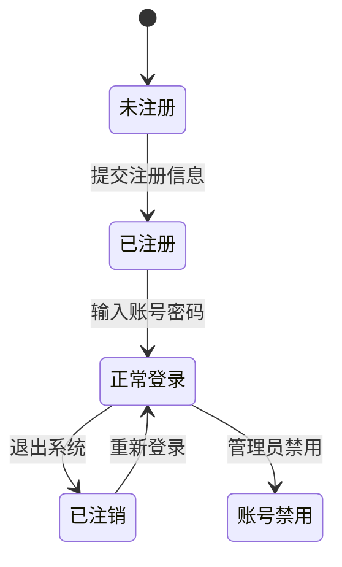
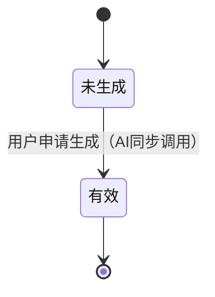
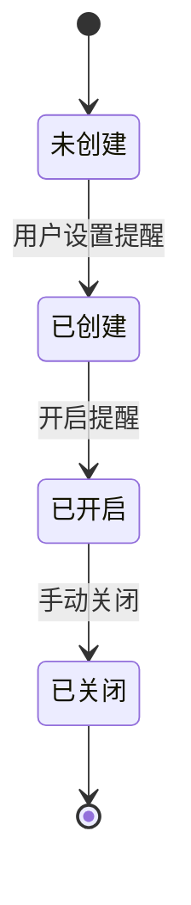

# AI个性化私人健康管理系统 软件需求规格说明书

**文档版本**：V2.0
**编写日期**：2026年6月19日
**编制人**：滕发德（项目经理）
**审核人**：前端组、后端组全体成员

## 修订历史

| 版本 | 日期 | 修改人 | 修改内容 |
|------|------|--------|----------|
| V1.0 | 2026年5月19日 | 滕发德 | 初始版本 |
| V2.0 | 2026年6月19日 | 滕发德 | 根据具体实现修改部分描述，需求不变 |

## 目录

1. 文档概述

2. 软件系统一般性描述

3. 软件功能需求

4. 软件质量（非功能性）需求

5. 软件开发约束需求

6. 数据需求

7. 接口需求

8. 其他需求

---

## 1. 文档概述

### 1.1 编写目的

本文档为**AI个性化私人健康管理系统**的正式软件需求规格说明书（SRS）。依据软件工程规范，明确系统的功能需求、非功能需求、数据需求与开发约束，作为项目设计、开发、测试、验收的唯一依据，确保团队成员对需求达成一致理解，保障课程实践项目按期高质量交付。

### 1.2 文档范围

本文档覆盖系统**用户端、管理员端、服务端、AI服务端**全链路需求，包含功能定义、优先级划分、交互规则、质量指标、开发约束、数据实体与接口规范，不含硬件采购、第三方医疗系统对接等超出课程范围的内容。

### 1.3 读者对象

- 开发团队：前端、后端，指导代码实现；

- 测试团队：设计测试用例、开展功能与非功能测试；

- 课程评审组：审核需求完整性、规范性与合理性。

### 1.4 文档约定

- 需求优先级：**Must（必须实现）> Should（应该实现）> Could（可选实现）**；

- 术语定义：

    - **AI服务**：基于FastAPI封装的大模型接口，提供健康画像、健康计划生成能力；

    - **健康数据**：血压、血糖、体重、运动时长、睡眠时长等个人日常健康指标；

    - **健康画像**：AI基于用户历史健康数据生成的综合评估报告，包含健康标签、风险等级和简要分析；

    - **健康计划**：AI根据用户健康画像生成的个性化饮食、运动、睡眠等生活方式建议；

    - **健康标签**：如"高血压风险"、"体重超标"等，用于标识用户健康状况的关键词；

    - **UML模型**：文档中标注"详见附录"的图表，为配套提交的需求模型素材。

---

## 2. 软件系统一般性描述

### 2.1 产品愿景

打造轻量化、易操作、合规化的Web端健康管理工具，帮助普通用户无需专业医疗知识，即可完成健康数据管理、AI健康评估与个性化健康指导，助力养成健康生活习惯。

### 2.2 用户群体

#### 2.2.1 普通用户（核心用户）

- 特征：18-65岁普通/亚健康人群，无专业医疗背景；

- 核心诉求：记录健康数据、获取AI健康分析、接收健康提醒、学习健康知识。

#### 2.2.2 管理员

- 特征：系统维护人员；

- 核心诉求：管理用户账号、统计平台健康数据、监控系统运行状态。

### 2.3 系统功能概述

系统采用**前后端分离架构**，分为三层协同工作：

1. **前端层**：Vue实现用户端与管理员端界面，负责交互展示、数据录入、可视化呈现；

2. **业务服务层**：Spring Boot处理数据存储、权限控制、定时任务，对接AI服务；

3. **AI服务层**：FastAPI封装公开大模型API，实现健康画像、健康计划生成、健康知识推送。

### 2.4 运行环境

- 操作系统：Windows 10及以上；

- 浏览器：Chrome、Firefox、Edge（主流浏览器）；

- 技术依赖：Spring Boot 3.5.7、Vue 3.5.x、Vite 8.x、Vue Router 5.x、FastAPI 0.115+、MySQL 8.4、JDK 21、Maven Wrapper（Maven 3.9.15）、Python 3.10+、Node.js 20.19+ 或 22.12+（演示环境推荐 Node.js 24.x）、npm 10+。

---

## 3. 软件功能需求

### 3.1 软件功能概述

系统核心功能分为**6大模块**：用户管理、健康数据管理、AI健康分析、健康提醒、健康可视化、管理员管理，覆盖用户端与管理员端全场景需求。

### 3.2 软件功能需求优先级

#### 3.2.1 Must（必须实现）

- 用户注册、登录、个人信息管理；

- 健康数据手动录入、查询；

- AI健康画像生成、个性化健康计划生成；

- 健康提醒设置与推送；

- 健康趋势可视化；

- 管理员用户管理、健康数据统计。

#### 3.2.2 Should（应该实现）

- 健康数据批量导入；
- 健康知识推送；
- 健康报告导出、系统日志查看；
- 用户反馈提交（未实现，数据库已建表）。

#### 3.2.3 Could（可选实现）

- 健康知识点赞收藏（未实现）、用户健康排名（未实现）。

### 3.3 软件功能需求描述

#### 1）软件的用例模型及描述

详见**附录A.1 系统用例图**，核心用例如下：

- 普通用户：注册、登录、管理个人信息、录入/查询健康数据、生成健康画像、生成健康计划、设置提醒、查看可视化报告、导出健康报告；

- 管理员：登录、管理用户、统计健康数据、查看系统日志。

#### 2）用例的交互模型及描述

#### ① 用户注册用例

- 前置条件：用户未登录，手机号未被注册；
- 输入：手机号、用户名、密码、确认密码；
- 交互流程：校验手机号唯一性→校验密码一致性→创建用户账号→返回注册结果；
- 输出：注册成功提示 / 手机号已存在 / 密码不一致提示；
- 后置条件：用户账号创建成功，可登录系统。

#### ② 健康数据录入用例

- 前置条件：用户已登录，进入健康数据管理页面；
- 输入：数据类型（血压/血糖等）、数值、单位、录入时间、冲突覆盖策略；
- 交互流程：校验数据合法性→处理时间冲突→保存数据至数据库→返回操作结果；
- 输出：数据保存成功提示、录入记录列表；
- 后置条件：健康数据持久化存储，可用于后续分析和可视化。

#### ③ AI健康画像生成用例

- 前置条件：用户已登录，存在历史健康数据；
- 输入：用户ID、历史健康数据；
- 交互流程：调用AI服务→生成健康标签/风险等级/分析报告→持久化存储→返回画像结果；
- 输出：健康画像报告（标签、风险等级、简要分析）；
- 后置条件：健康画像保存至数据库，可随时查看。

#### ④ 管理员用户管理用例

- 前置条件：管理员已登录，拥有管理员权限；
- 输入：用户名、手机号、账号状态；
- 交互流程：查询用户列表→执行禁用/启用操作→返回操作结果；
- 输出：用户列表、操作成功提示；
- 后置条件：用户状态变更生效，相关操作记录日志。

#### 3）软件需求的分析类模型及描述

详见**附录A.2 系统分析类图**，系统核心实体类包括：User类、HealthData类、HealthProfile类、HealthPlan类、Reminder类等，各实体类的属性、方法及类间关系以附录A.2类图为准。

#### 4）对象的状态模型及描述

详见**附录A.3 核心对象状态图**，关键对象状态如下：

- **用户对象**：未注册→注册→正常登录→退出登录 / 禁用；

- **健康计划对象**：生成→有效→失效；

- **提醒对象**：创建→开启→关闭 / 删除。

---

## 4. 软件质量（非功能性）需求

### 4.1 性能需求

1. 页面加载响应时间≤2秒，数据查询响应时间≤1秒；

2. AI接口响应时间≤5秒，高峰期无超时报错；

3. 系统并发支持≥10人同时操作，无卡顿、数据丢失。

### 4.2 安全性需求

1. 用户密码加密存储，禁止明文存储；

2. 角色权限隔离：普通用户仅查看个人数据，管理员可查看用户列表及统计数据，但无权查看用户密码等敏感信息；

3. 接口请求校验，防止非法请求、SQL注入攻击；

4. 登录日志完整记录，支持异常行为追溯。

### 4.3 易用性需求

1. 核心操作流程≤3步，界面简洁、提示清晰；

2. 适配主流浏览器，无排版错乱、操作卡顿问题；

3. 无专业术语，适配普通用户认知水平。

### 4.4 可靠性需求

1. 本地连续运行72小时无崩溃、无异常退出；

2. 数据提交自动保存，网络中断恢复后数据不丢失；

3. AI服务调用失败时返回友好提示，不影响其他功能。

### 4.5 可维护性需求

1. 代码模块化、注释清晰，符合开发规范；

2. 数据库表设计合理，字段命名规范，便于扩展；

3. 接口文档完整，标注参数、返回值与调用方式。

### 4.6 合规性需求

1. AI建议仅提供生活方式指导，**不涉及医疗诊断、用药推荐**；

2. 健康知识符合权威健康规范，无虚假、违规信息；

3. 用户数据仅用于个人健康管理，不泄露、不对外共享。

---

## 5. 软件开发约束需求

### 5.1 技术约束

- 必须采用**Spring Boot+Vue+FastAPI+MySQL**技术栈，禁止替换核心框架；

- AI功能仅调用公开大模型API，不自主训练医疗模型；

- 仅开发Web端，不支持移动端App开发。

### 5.2 工期约束

- 项目周期：5周，严格按周完成里程碑任务；

- 文档交付：需求、设计、测试文档按期提交，不延期。

### 5.3 合规约束

- 严格遵守医疗健康行业规范，AI输出内容需规避医疗风险；

- 符合软件工程课程考核标准，文档格式、功能完整性达标。

---

## 6. 数据需求

### 6.1 核心数据实体

系统包含以下核心数据实体：

- **用户表（user）**：存储用户基本信息、登录凭证、角色等；
- **健康数据表（health_data）**：存储用户录入的健康指标数据；
- **提醒表（reminder）**：存储用户健康提醒设置；
- **健康画像表（health_profile）**：存储AI生成的用户健康评估结果；
- **健康计划表（health_plan）**：存储AI生成的个性化健康计划；
- **健康知识库表（knowledge）**：存储健康知识内容；
- **知识推送记录表（knowledge_push）**：记录知识推送状态；
- **用户反馈表（feedback）**：记录用户对健康计划的反馈；
- **登录日志表（login_log）**：记录用户登录行为。

具体表结构（字段名、类型、约束）详见数据库设计文档及 `docker/mysql/init/` 目录下的SQL建表脚本。

---

## 7. 接口需求

### 7.1 前端-后端接口

- 用户接口：注册、登录、个人信息查询/修改接口；
- 健康数据接口：录入、查询、批量导入接口；
- AI接口：健康画像、健康计划、健康知识推送接口；
- 提醒接口：设置、查询、状态修改接口；
- 管理员接口：用户管理、数据统计、日志查询接口。

### 7.2 后端-AI服务接口

后端通过HTTP协议调用AI服务（FastAPI）完成健康画像生成、健康计划生成等功能。

### 7.3 数据库接口

后端通过Spring Data JPA连接MySQL 8.4数据库进行数据持久化操作。

具体接口规范（请求方式、地址、参数、返回值）详见软件体系结构设计文档及后端接口文档。

---

## 8. 其他需求

### 8.1 文档需求

- 交付完整设计文档、接口文档、测试报告、部署说明；

- 代码附带注释文档，说明模块功能与核心逻辑。

### 8.2 部署需求

- 支持本地Windows一键部署，提供脚本与配置说明；

- 答辩环境可运行，支持模拟数据演示。

### 8.3 验收标准

1. 所有Must功能正常运行，无严重Bug，核心流程可完整演示；

2. 非功能需求达标，系统响应快、界面友好、数据安全合规；

3. 所有课程交付物齐全、规范，符合软件工程考核标准。

---

## 附录A 系统UML模型图

### A.1 系统用例图

```mermaid
graph TD
    %% 参与者
    User[普通用户]
    Admin[管理员]
    System[系统]

    %% 普通用户用例
    UC1[注册账号]
    UC2[登录系统]
    UC3[管理个人信息]
    UC4[录入健康数据]
    UC5[查询健康数据]
    UC6[生成AI健康画像]
    UC7[生成个性化健康计划]
    UC8[设置健康提醒]
    UC9[查看健康可视化报告]
    UC10[导出健康报告]
    UC11[提交健康反馈（未实现）]

    %% 管理员用例
    AUC1[管理员登录]
    AUC2[用户账号管理]
    AUC3[平台健康数据统计]
    AUC5[查看系统登录日志]

    %% 关联关系
    User --> UC1
    User --> UC2
    User --> UC3
    User --> UC4
    User --> UC5
    User --> UC6
    User --> UC7
    User --> UC8
    User --> UC9
    User --> UC10
    User --> UC11

    Admin --> AUC1
    Admin --> AUC2
    Admin --> AUC3
    Admin --> AUC5

    System --> UC6
    System --> UC7
    System --> UC8
```

### A.2 系统分析类图

### A.3 核心对象状态图

#### A.3.1 用户对象状态图

#### A.3.2 健康计划对象状态图

注：`isValid` 字段已定义（1=有效/0=失效），但"用户设为失效"功能尚未实现。

#### A.3.3 健康提醒对象状态图

---
